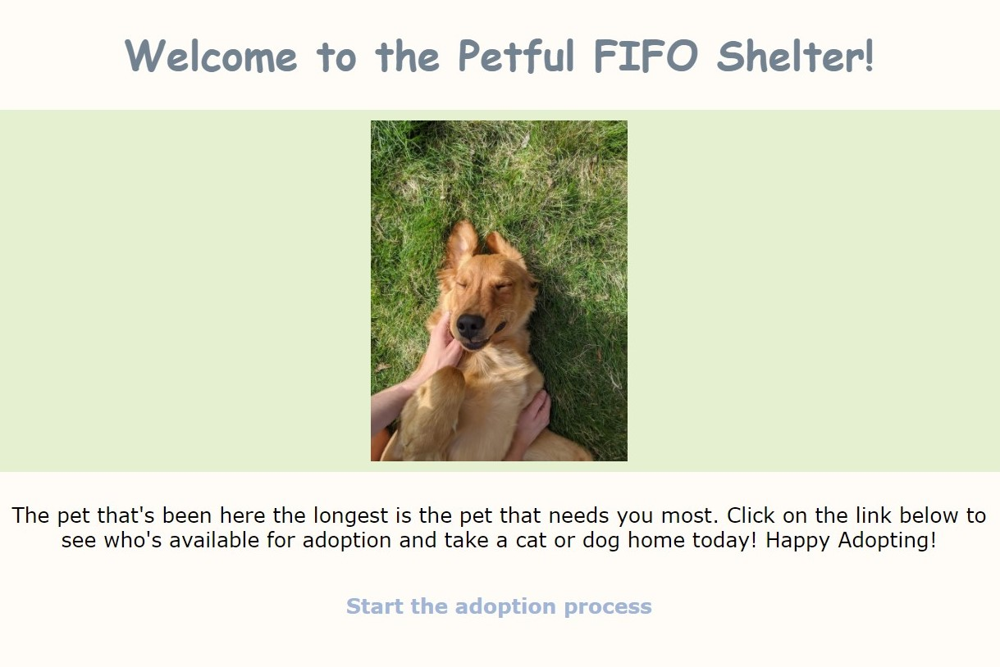
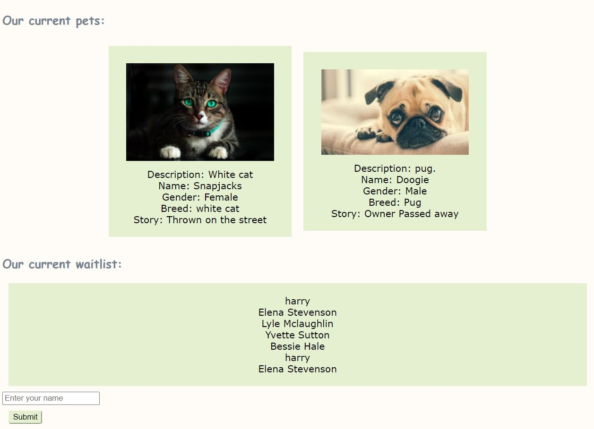

# Petful Client

This project was bootstrapped with [Create React App](https://github.com/facebook/create-react-app).

### Live App: https://petful-fifo-lake.vercel.app/
### Server Repo: https://github.com/rhiannonsmeby/petful-server

### Screenshots

### Summary
This application simulates an animal shelter that adopts pets out on a First In First Out basis. The user can add their name to the line and, when it is their turn, they can adopt one or both pets that are at the top of the queue.

### Technology Used
* React.js
* HTML
* CSS
* Node.js
* Express
